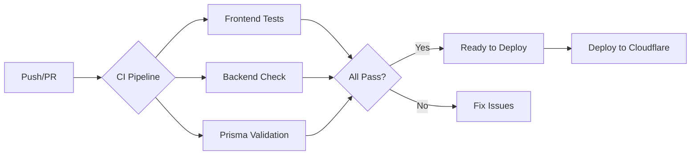

# CI/CD パイプライン

このプロジェクトは、GitHub Actionsを使用した自動化されたCI/CDパイプラインを備えています。

## 📋 概要



## 🔄 CI（継続的インテグレーション）

### トリガー
- すべてのプッシュ（main, develop, feature/* ブランチ）
- main/develop へのプルリクエスト

### チェック項目

#### ✅ フロントエンド
1. **Lint** - ESLint でコード品質をチェック
2. **型チェック** - TypeScript の型エラーを検出
3. **テスト** - Jest で単体テスト実行（50テスト）
4. **ビルド** - Next.js のプロダクションビルドを検証
5. **カバレッジ** - テストカバレッジを Codecov にアップロード

#### ✅ バックエンド
1. **型チェック** - TypeScript の型エラーを検出
2. **Prisma** - データベーススキーマの整合性を確認
3. **テスト** - 設定されている場合に実行

#### ✅ Prisma
1. **スキーマ検証** - データベーススキーマの構文チェック
2. **フォーマット** - スキーマのフォーマットをチェック

### 実行時間
平均 **3-5分** で完了

---

## 🚀 CD（継続的デプロイメント）

### トリガー
- main ブランチへのプッシュ
- 手動トリガー（GitHub Actions UIから）

### デプロイフロー

```
Test → Type Check → Deploy to Cloudflare Workers
 ↓         ↓              ↓
Pass     Pass         Production
```

### ステップ

1. **テスト実行**
   - フロントエンドのテストとビルドを実行
   - すべて成功した場合のみ次へ

2. **バックエンドデプロイ**
   - Prisma クライアント生成
   - 型チェック実行
   - Cloudflare Workers へデプロイ

### デプロイ先
- **バックエンド**: Cloudflare Workers
- **フロントエンド**: （今後設定予定）

---

## 🛠️ ローカル開発でのチェック

デプロイ前に、ローカルでCIと同じチェックを実行できます：

### フロントエンド
```bash
cd frontend

# 依存関係インストール
pnpm install --frozen-lockfile

# Lint
pnpm lint

# 型チェック
pnpm exec tsc --noEmit

# テスト
pnpm test

# ビルド
pnpm build
```

### バックエンド
```bash
cd backend

# 依存関係インストール
pnpm install --frozen-lockfile

# Prisma生成
pnpm prisma:generate

# 型チェック
pnpm exec tsc --noEmit
```

---

## 🔐 必要なシークレット

GitHubリポジトリの Settings → Secrets に以下を設定：

| シークレット名 | 説明 | 必須 |
|--------------|------|------|
| `CLOUDFLARE_API_TOKEN` | Cloudflare API トークン | ✅ デプロイに必須 |
| `CLOUDFLARE_ACCOUNT_ID` | Cloudflare アカウントID | ✅ デプロイに必須 |
| `NEXT_PUBLIC_API_URL` | API URL | ⚠️ オプション（デフォルト: localhost:8787） |

---

## 📊 ステータスバッジ

プロジェクトのREADMEに以下のバッジを追加できます：

```markdown


```

---

## 🔍 トラブルシューティング

### CI が失敗する場合

1. **ローカルで再現**
   ```bash
   pnpm test
   pnpm build
   ```

2. **ログを確認**
   - GitHub Actions の詳細ログを確認
   - エラーメッセージから原因を特定

3. **よくある問題**
   - 依存関係の不整合 → `pnpm-lock.yaml` を更新
   - 型エラー → `pnpm exec tsc --noEmit` で確認
   - テスト失敗 → `pnpm test -- --verbose` で詳細確認

### デプロイが失敗する場合

1. **シークレットを確認**
   - Cloudflare API トークンが有効か
   - アカウントIDが正しいか

2. **ローカルでデプロイテスト**
   ```bash
   cd backend
   pnpm wrangler dev
   ```

3. **Cloudflare ダッシュボード**
   - Workers のログを確認
   - エラーメッセージを確認

---

## 📈 今後の改善予定

- [ ] E2Eテスト（Playwright）の追加
- [ ] セキュリティスキャン（Dependabot）
- [ ] パフォーマンステスト（Lighthouse CI）
- [ ] ステージング環境の構築
- [ ] 自動リリースノート生成
- [ ] Slack/Discord 通知

---

## 📚 参考リンク

- [GitHub Actions ドキュメント](https://docs.github.com/en/actions)
- [Cloudflare Workers ドキュメント](https://developers.cloudflare.com/workers/)
- [Wrangler CLI](https://developers.cloudflare.com/workers/wrangler/)
