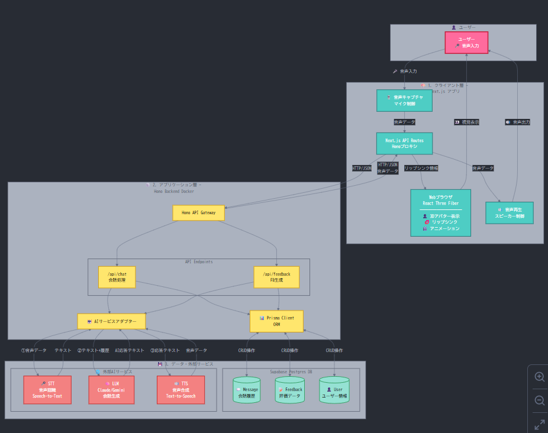

# 恋愛をしたい男子諸君のためのアプリ恋 AI


[](https://www.youtube.com/watch?v=lA9EluZugD8)

## セットアップ

### 必要な環境

- Node.js 20 以上
- pnpm 10.14.0
- Docker & Docker Compose (オプション)

### インストール

```bash
# 依存関係のインストール
pnpm install

# 環境変数の設定
# ルートディレクトリで .env ファイルを作成
cp .env.example .env

# .env ファイルを編集して以下を設定:
# - DATABASE_URL (Supabase接続URL)
# - NEXT_PUBLIC_SUPABASE_URL
# - NEXT_PUBLIC_SUPABASE_ANON_KEY
# - GEMINI_API_KEY (Google AI Studio APIキー)
# - ELEVENLABS_API_KEY (ElevenLabs APIキー)
# - ELEVENLABS_VOICE_ID (使用する音声ID)
# - NEXT_PUBLIC_API_URL (バックエンドのURL、デフォルト: http://localhost:8787)

# Backend用のシンボリックリンクを作成（まだ存在しない場合）
cd backend
ln -s ../.env .env
cd ..
```

> **Note**: このプロジェクトでは、ルートディレクトリの `.env` ファイルを中心に環境変数を管理しています。
> `backend/.env` はルートの `.env` へのシンボリックリンクとして作成することで、環境変数を一元管理できます。

### データベースセットアップ

1. [Supabase](https://supabase.com/)でプロジェクトを作成
2. SQL Editor で[docs/database-schema.md](docs/database-schema.md)の SQL を実行
3. フロントエンドの`.env`に認証情報を追加

### 開発環境の起動

#### 方法 1: ローカル環境で起動

```bash
# Frontend (Next.js) - ターミナル1
cd frontend
pnpm dev
# http://localhost:3000 でアクセス可能

# Backend (Hono + Cloudflare Workers) - ターミナル2
cd backend
pnpm dev
```

#### 方法 2: Docker で起動

```bash
# Frontend を Docker で起動 (ホットリロード有効)
docker compose --profile dev up frontend-dev

# Backend は別ターミナルでローカル起動
cd backend
pnpm dev
```

### 本番ビルド

#### Frontend (Docker)

```bash
# Dockerイメージのビルドと起動
docker compose up frontend

# または手動ビルド
docker build -t tk_b_2515 .
docker run -p 3000:3000 tk_b_2515
```

#### Backend (Cloudflare Workers)

```bash
cd backend
pnpm deploy
```

## プロジェクト構成

```
tk_b_2515/
├── frontend/               # Next.js フロントエンド
│   ├── src/
│   │   ├── app/           # Next.js App Router (ページ)
│   │   │   ├── page.tsx           # ホームページ
│   │   │   ├── simulation/        # 会話シミュレーション
│   │   │   └── feedback/          # フィードバック表示
│   │   ├── components/    # UIコンポーネント
│   │   │   ├── Avatar/           # VRMアバター関連
│   │   │   └── ui/               # shadcn/ui コンポーネント
│   │   ├── hooks/        # カスタムフック
│   │   ├── lib/          # ユーティリティ・設定
│   │   │   ├── api/              # APIクライアント
│   │   │   │   ├── client.ts    # 基底APIクライアント
│   │   │   │   ├── voices.ts    # 音声API
│   │   │   │   └── speech.ts    # STT API
│   │   │   ├── config.ts         # 環境変数設定
│   │   │   ├── database.ts       # Supabaseクライアント
│   │   │   └── utils.ts          # ユーティリティ関数
│   │   └── types/        # TypeScript型定義
│   │       └── api.ts            # API型定義
│   └── .env.example      # 環境変数サンプル
├── backend/              # Hono + Cloudflare Workers
│   ├── src/
│   │   ├── index.ts      # エントリーポイント
│   │   ├── routes/       # APIルート
│   │   ├── services/     # ビジネスロジック
│   │   └── middleware/   # ミドルウェア
│   └── wrangler.toml     # Cloudflare設定
└── README.md
```

## 製品概要
純愛を求める男子学生のためのアプリ、恋 AI(renai)。

### 背景（製品開発のきっかけ、課題等）
#### きっかけ
理工系の学校は往々にして女子率が低く、女性経験が少ない男子生徒が多い。それを手助けできるアプリケーションが作りたかった。嘘です。ほんとは単純に彼女が欲しすぎました。

僕らは彼女がいない理系国立大生で、恋愛指南書や無料の女性との会話方法を学ぼうと奮起していたが、ずっとうまくいっていない。

いくらYouTubeや本などで学習をしても、実際に話す経験が足りず、またオタク特有のきょどったり目線が合わない、ボソボソ喋るなどは客観的に見ることが出来ないため、その根本を解決する必要があると感じた。

#### 課題
ペルソナ
異性との交流が少ない理系大学生、異性と話すのが苦手な人、つまり自分たち。これを細分化すると、喋れない人は大きく分けて2パターン存在すると考えた。

1. 話題や質問が浮かばない人。
2. 声や表情や仕草がぎこちない人。

本アプリは、その二つの視点でフィードバックを提供することで、ユーザーの課題解決を目指す。

### 製品説明（具体的な製品の説明）



### 特長

#### 1. 特長 1(HackDay中)
従来のAIの女性と会話する系のプロダクトはテキスト形式のみの場合が多いが、相手の表情と音声を実装することで、既存のサービスよりもリアルな会話シミュレーションが可能。

#### 2. 特長 2(HackDay前)
カメラでユーザーの目線や仕草を認識し、会話に与える印象を測定する。これにより非言語コミュニケーションに踏み込んた評価に挑戦。会話の基本は相手の目を見ること！！

#### 3. 特長 3(HackDay中)
言語(会話)、非言語(表情)の2方面からの会話のフィードバックを提供する。

### 解決出来ること
現実で異性との会話を盛り上げる方法を自然に身に着けられる。

### 今後の展望


### 注力したこと（こだわり等）
#### 評価とアドバイス(HackDay中)
会話と表情の2種類のフィードバックをする。
AIが自動フィードバックとして「ここが良かった」、「ここが改善点」などを提示する。

- 会話フィードバック例：「相手の趣味を掘り下げられる質問が◎」
- 表情フィードバック例：「表情は自然でしたが、相槌が少なめでした」

#### 臨場感(HackDay中)
瞬き、表情、手のしぐさをリアルに再現することで、女の子と話す

#### トーンとステップ(HackDay前)
フィードバックは若干辛めで、AIが読み上げてくれる。
会話と表情の良いところ悪いところを挙げた後、ネクストステップとして「次はこうしよう」みたいなアドバイスが優しめに出る。


## 開発技術

### 活用した技術

#### API・データ

-
-

#### フレームワーク・ライブラリ・モジュール

-
-

#### デバイス

-
-

### 独自技術

#### ハッカソンで開発した独自機能・技術

- 独自で開発したものの内容をこちらに記載してください
- 特に力を入れた部分をファイルリンク、または commit_id を記載してください。
