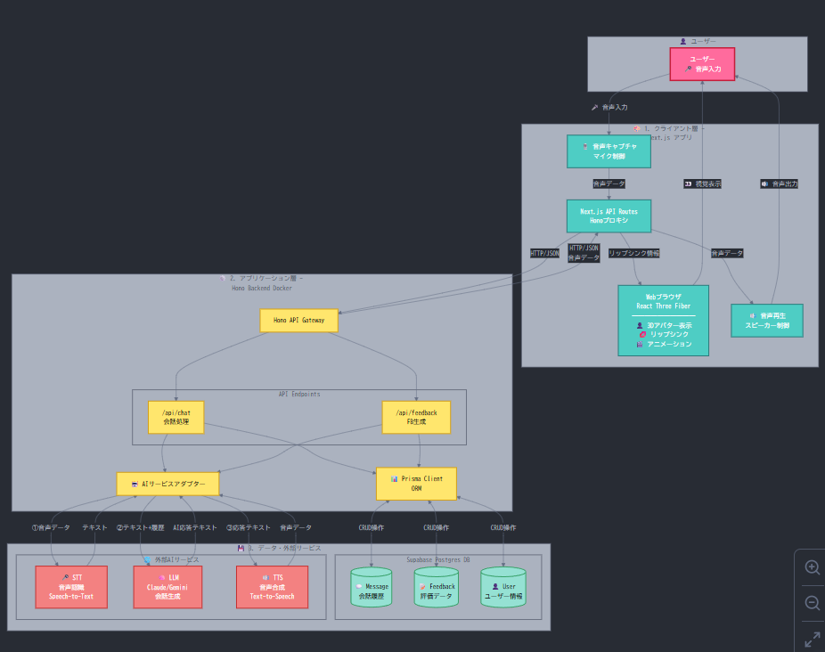

# 恋愛をしたい男子諸君のためのアプリ恋 AI


[](https://www.youtube.com/watch?v=lA9EluZugD8)

## セットアップ

### 必要な環境

- Node.js 20 以上
- pnpm 10.14.0
- Docker & Docker Compose (オプション)

### インストール

```bash
# 依存関係のインストール
pnpm install

# 環境変数の設定
# Frontend
cd frontend
cp .env.example .env
# .env ファイルを編集して以下を設定:
# - NEXT_PUBLIC_API_URL (バックエンドのURL)
# - NEXT_PUBLIC_SUPABASE_URL
# - NEXT_PUBLIC_SUPABASE_ANON_KEY

# Backend
cd ../backend
cp .env.example .env
# .env ファイルを編集して以下を設定:
# - ELEVENLABS_API_KEY
```

### データベースセットアップ

1. [Supabase](https://supabase.com/)でプロジェクトを作成
2. SQL Editor で[docs/database-schema.md](docs/database-schema.md)の SQL を実行
3. フロントエンドの`.env`に認証情報を追加

### 開発環境の起動

#### 方法 1: ローカル環境で起動

```bash
# Frontend (Next.js) - ターミナル1
cd frontend
pnpm dev
# http://localhost:3000 でアクセス可能

# Backend (Hono + Cloudflare Workers) - ターミナル2
cd backend
pnpm dev
```

#### 方法 2: Docker で起動

```bash
# Frontend を Docker で起動 (ホットリロード有効)
docker compose --profile dev up frontend-dev

# Backend は別ターミナルでローカル起動
cd backend
pnpm dev
```

### 本番ビルド

#### Frontend (Docker)

```bash
# Dockerイメージのビルドと起動
docker compose up frontend

# または手動ビルド
docker build -t tk_b_2515 .
docker run -p 3000:3000 tk_b_2515
```

#### Backend (Cloudflare Workers)

```bash
cd backend
pnpm deploy
```

## プロジェクト構成

```
tk_b_2515/
├── frontend/               # Next.js フロントエンド
│   ├── src/
│   │   ├── app/           # Next.js App Router (ページ)
│   │   │   ├── page.tsx           # ホームページ
│   │   │   ├── simulation/        # 会話シミュレーション
│   │   │   └── feedback/          # フィードバック表示
│   │   ├── components/    # UIコンポーネント
│   │   │   ├── Avatar/           # VRMアバター関連
│   │   │   └── ui/               # shadcn/ui コンポーネント
│   │   ├── hooks/        # カスタムフック
│   │   ├── lib/          # ユーティリティ・設定
│   │   │   ├── api/              # APIクライアント
│   │   │   │   ├── client.ts    # 基底APIクライアント
│   │   │   │   ├── voices.ts    # 音声API
│   │   │   │   └── speech.ts    # STT API
│   │   │   ├── config.ts         # 環境変数設定
│   │   │   ├── database.ts       # Supabaseクライアント
│   │   │   └── utils.ts          # ユーティリティ関数
│   │   └── types/        # TypeScript型定義
│   │       └── api.ts            # API型定義
│   └── .env.example      # 環境変数サンプル
├── backend/              # Hono + Cloudflare Workers
│   ├── src/
│   │   ├── index.ts      # エントリーポイント
│   │   ├── routes/       # APIルート
│   │   ├── services/     # ビジネスロジック
│   │   └── middleware/   # ミドルウェア
│   └── wrangler.toml     # Cloudflare設定
└── README.md
```

## 製品概要

純愛を求める男子学生のためのアプリ、恋 AI(renai)。

### 背景（製品開発のきっかけ、課題等）

弊学は女子率が低く女性経験が少ない男子生徒が多く、それを手助けできるアプリケーションが作りたかった。嘘です。ほんとは単純に彼女が欲しすぎました。

### 製品説明（具体的な製品の説明）



### 特長

#### 1. 特長 1

#### 2. 特長 2

#### 3. 特長 3

### 解決出来ること

### 今後の展望

### 注力したこと（こだわり等）

-
-

## 開発技術

### 活用した技術

#### API・データ

-
-

#### フレームワーク・ライブラリ・モジュール

-
-

#### デバイス

-
-

### 独自技術

#### ハッカソンで開発した独自機能・技術

- 独自で開発したものの内容をこちらに記載してください
- 特に力を入れた部分をファイルリンク、または commit_id を記載してください。
