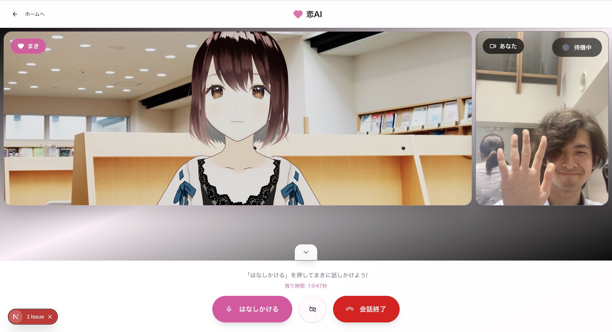
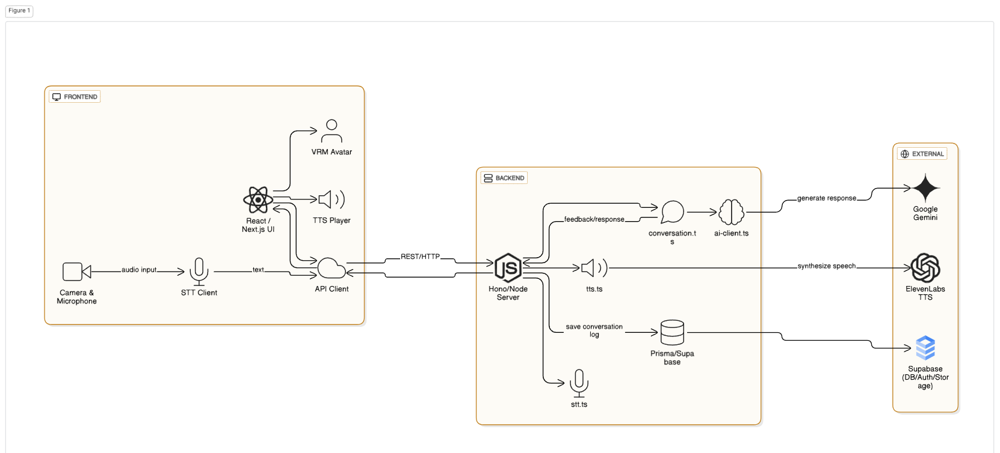

# 純愛を求める男子学生のためのアプリ、"**恋 AI(renai)**"

[](https://youtu.be/tYjXiZOQHnI?si=hFwHpYndLv_864NE)

### 各種リンク

###  恋 AI: https://renailove.vercel.app 
　　　　　　↑↑ここから使ってみてください！！↑↑
- 紹介動画: https://youtu.be/tYjXiZOQHnI?si=hFwHpYndLv_864NE

## 製品概要

**恋 AI(renai)** は、AI との 3D リアルタイム会話シミュレーションを通じて、コミュニケーションスキルを向上させる Web アプリケーションです。

---

## 背景（製品開発のきっかけ、課題等）

### きっかけ

理工系の学校は往々にして女子率が低い。これは内閣府のデータとしても顕著である。（分野別にみた、入学者に占める女性比率の全国数値は、「理学」分野が 30.2％、「工学」分野が 15.2％　出典: [令和 3 年度「理工系分野の選択に関する調査研究」概要](https://www.gender.go.jp/research/kenkyu/pdf/riko_sentaku_research_r03_gaiyo.pdf)）そのため女性との会話経験が少ない男子生徒が多い。この問題を解決できるアプリケーションが作りたかった。
また、僕たち自身も多くのメンバーが女性と交流機会が少ない理系大生で、恋愛指南書や無料の女性との会話方法を学ぼうと奮起していたが、ずっとうまくいっていない。

**いくら YouTube や本などで学習をしても、実際に話す経験が足りず、またオタク特有のきょどったり目線が合わない、ボソボソ喋るなどは客観的に見ることが出来ないため、その根本を解決する必要があると感じた。**


### 課題

**ペルソナ**:
- 異性との交流が少ない理系大学生
- 異性と話すのが苦手な人
- 私たち（調布恋AI連合メンバー）

これを細分化すると、会話が苦手な人は大きく分けて **2 パターン** 存在すると考えました。

1. **話題や質問が浮かばない人** - 言語コミュニケーションの課題
2. **声や表情や仕草がぎこちない人** - 非言語コミュニケーションの課題

本アプリは、この **言語** と **非言語** の二つの視点からフィードバックを提供することで、ユーザーの課題解決を目指します。


## 製品説明（具体的な製品の説明）

恋 AI は以下の **3 つのステップ** でユーザーをサポートします：

1. **リアルタイム会話シミュレーション** - 3D アバター（VRM モデル）と音声で自然な会話練習を実施
2. **表情・視線分析** - MediaPipe を用いてリアルタイムに非言語コミュニケーションを分析
3. **AI フィードバック** - Google Gemini による会話の詳細分析と具体的なアドバイスを提供

---


## 特長

### 1. リアルな 3D 会話シミュレーション（HackDay 中）

従来の AI 会話アプリはテキスト形式のみの場合が多いですが、本アプリでは以下を実現しました：

#### 音声合成(TTS)とリップシンク

- **ElevenLabs API** による高品質な日本語音声合成
- **リアルタイム音声解析** - Web Audio API（AnalyserNode）で音声の周波数データを取得
- **人間の音声周波数範囲(300-3400Hz)** のみを抽出して分析精度を向上
- **スムーズなアニメーション** - アタック時間 50ms、リリース時間 100ms で自然な口の開閉を実現
- **FFT サイズ 2048** で高精度な周波数分析を実施

#### 3D アバター制御

- **@pixiv/three-vrm** を活用した VRM モデルのレンダリング
- **リップシンク値(0-1)** に基づいてアバターの口形状（Viseme）を制御
- **瞬き、表情、手のしぐさ** をリアルに再現

#### 会話フロー

1. **STT（音声 → テキスト）** - Web Speech API または ElevenLabs STT で音声認識
2. **AI 応答生成** - Google Gemini 2.5 Flash で自然な会話を生成
3. **TTS（テキスト → 音声）** - ElevenLabs API で音声合成
4. **リップシンク再生** - 音声に同期してアバターの口を動かす

これにより、**既存サービスよりもリアルな会話体験** を実現しています。


### 5. キャラクター選択機能

ユーザーが対話したいキャラクターを自由に選択できる機能を実装しました。これにより、様々なキャラクターとの会話をシミュレーションでき、より現実に近い状況で会話の練習ができます。

- **複数のキャラクターモデル** - 性格や話し方の異なる複数のキャラクターを用意
- **キャラクターに合わせた会話シナリオ** - 各キャラクターの個性に基づいた会話シナリオを生成
- **ユーザーの好みに合わせた練習** - ユーザーが苦手なタイプのキャラクターを選択し、集中的に練習することが可能

これにより、**既存サービスよりもリアルな会話体験** を実現しています。


### 2. 表情・視線の高度な分析（HackDay 中）

MediaPipe Face Landmarker を活用し、**478 点の顔ランドマーク**からユーザーの非言語コミュニケーションをリアルタイムに評価します：

#### 視線追跡アルゴリズム

- **顔の向きを計算** - 鼻先(landmark #1)と両目の中心(#33, #263)の相対位置から顔の向きを算出
- **ターゲット方向との一致度** - 顔の向きとアバターの位置(デフォルト: 左側中央 x=0.25, y=0.5)を比較
- **視線スコア(0-1)** - 水平・垂直方向の一致度から算出。0.6 以上で「相手を見ている」と判定
- **視線方向の判定** - 上下方向の視線を検出(up/down/center)し、視線が逸れる傾向を分析

#### 笑顔検出アルゴリズム

- **口角の位置を分析** - 左右の口角(#61, #291)と上下唇中央(#13, #14)から口の中心を計算
- **笑顔強度(0-1)** - 口角が口の中心より上にある度合いから笑顔の強さを算出
- **笑顔判定** - 強度 0.3 以上で「笑顔」と判定

#### パフォーマンス最適化

- **3fps（333ms 間隔）で分析** - CPU 負荷を抑えつつリアルタイム性を確保
- **GPU 処理** - MediaPipe の GPU delegate を活用して高速処理
- **差分更新** - 大きな変化がある場合のみ状態を更新し、不要な再レンダリングを防止

**会話の基本は相手の目を見ること！** 非言語コミュニケーションに踏み込んだ評価に挑戦しました。


### 3. 親密度システムによる段階的会話（HackDay 中）

**[コミット ID: d0460af](https://github.com/jphacks/tk_b_2515/commit/d0460af01d81d6bfe968320336ca9f07f4c26a7b)**

会話の進展に応じて AI の応答スタイルが変化する独自システムを実装しました：

- **shy（初対面）** - 距離を取った控えめな応答
- **friendly（打ち解け中）** - 明るく自然な言葉遣い
- **open（仲良し）** - 親しみのある素直な反応

親密度を段階的に評価することで **会話の盛り上がりを再現** し、絵文字を使うことで親密度の表現幅を広げることに挑戦しました。

**実装**: [backend/src/services/conversation.ts#L34-L92](backend/src/services/conversation.ts#L34-L92)


### 4. 言語・非言語の 2 方面フィードバック（HackDay 中）

Google Gemini による詳細な会話分析を行います：

#### 会話評価（言語面）

**評価基準（重要度順）**

1. **会話の主導力（高）** - ユーザーが積極的に話題を提供し、会話をリードできているか
2. **会話の継続力（高）** - 会話が途切れそうな時に、ユーザーが話題を提供しているか
3. **話題の展開力（中）** - 一つの話題から自然に次の話題に展開できているか
4. **共感力や傾聴姿勢（中）** - 相手の話をしっかり聞き、適切な反応をしているか
5. **質問の適切さ（中）** - 相手が答えやすく、会話を深める質問ができているか

**減点要素**

- AI が質問を投げかける回数が多い: -10 点/回
- 会話が途切れそうになった回数: -5 点/回
- ユーザーの発言が短すぎる: -3 点/回

#### 仕草評価（非言語面）

**評価基準**

- **笑顔の頻度と強度** - `smilingSamples`、`smileIntensityAvg`、`smileIntensityMax`から評価
- **視線の安定性** - `gazeScoreAvg`（0-1、1 が最適）で視線の安定度を測定
- **視線の方向** - `gazeUpSamples`が多いと「嘘をついている/ごまかしている」と判断
- **視線が下向き** - `gazeDownSamples`が多いと「自信がない」と判断
- **視線がキョロキョロ** - 視線スコア平均が 0.5 未満、または視線が上下に向いた回数の合計が総サンプル数の 20%超で「挙動不審」と評価

#### 総合スコア算出

- 言語面と非言語面を統合して **0-100 点** で評価
- 具体的な改善点と良かった点を提示

**フィードバック例**:

- 会話: 「相手の趣味を掘り下げられる質問が ◎」
- 表情: 「視線が安定していて好印象でした。もう少し笑顔があるとさらに良いです」


### 5. キャラクター選択機能

ユーザーが対話したいキャラクターを自由に選択できる機能を実装しました。これにより、様々なキャラクターとの会話をシミュレーションでき、より現実に近い状況で会話の練習ができます。

- **複数のキャラクターモデル** - 性格や話し方の異なる複数のキャラクターを用意
- **キャラクターに合わせた会話シナリオ** - 各キャラクターの個性に基づいた会話シナリオを生成
- **ユーザーの好みに合わせた練習** - ユーザーが苦手なタイプのキャラクターを選択し、集中的に練習することが可能

---


## 解決できること

本アプリを使うことで、以下のことが可能になります：

- 現実で異性との会話を盛り上げる方法を自然に身に着けられる
- 自信をもって、他人とコミュニケーションが取れるようになる
- 客観的に自分の会話スタイルや非言語表現を把握できる

---


## 今後の展望

今後、以下の機能追加・改善を予定しています：

- ジェスチャーをモーション（アニメーション）で実装し、より多彩で滑らかな非言語表現を目指す
- 女性のフィードバックを増やし、より現実的な採点基準を追求する
- AI のボイスを用いて、フィードバックやワンポイントアドバイスを読み上げる
- ユーザーのニーズに合わせた **キャラクター選択機能** を実装
- 自分ら用だけでなく、**婚活、就活、自分ができてると思い込んでる人、女性** などの潜在的なターゲットに向けてシェアを広げる

---


## 注力したこと（こだわり等）


### 1. リアルタイム会話シミュレーション

以下の機能を実装し、リアルな会話体験を実現しました：

- **3D アバター（VRM）との対話** - [@pixiv/three-vrm](https://github.com/pixiv/three-vrm) を活用した高品質なアバター表示（HackDay 中）
- **音声認識（STT）** - Web Speech API を用いた自然な音声入力（HackDay 前）
- **AI 応答の音声合成（TTS）** - ElevenLabs API による高品質な音声生成（HackDay 中）
- **リップシンク** - 音声に同期したアバターの口の動き（HackDay 中）
- **瞬き、表情、手のしぐさ** をリアルに再現（HackDay 中）

**実装**: [frontend/src/components/Avatar/](frontend/src/components/Avatar/)


### 2. 表情分析機能

MediaPipe を活用し、高度な表情・視線分析を実現しました：

- **MediaPipe Face Landmarker** によるリアルタイム顔認識（HackDay 中）
- **視線追跡** - 478 点の顔ランドマークから視線方向を算出（HackDay 中）
- **笑顔検出** - 口角と目の開き具合から笑顔強度を計算（HackDay 中）
- **非言語コミュニケーションの評価** - 心理学のサイトを参考に、唇や手で顔を隠したときにマイナス評価を与える（HackDay 中）

**実装**: [frontend/src/hooks/useFacialAnalysis.ts](frontend/src/hooks/useFacialAnalysis.ts)


### 3. AI フィードバックシステム

Google Gemini を活用した包括的なフィードバックシステムを構築しました：

- **会話終了後の詳細分析** - Google Gemini 2.5 Flash による高度な会話評価（HackDay 中）
- **言語、非言語の 2 方面** から良かった点と改善点を提示（HackDay 中）
- **総合スコア（0-100 点）の算出** - 会話の主導力、継続力、展開力などを評価（HackDay 前）
- **具体的なアドバイスの提供** - 次回の改善につながる実践的なフィードバック（HackDay 前）

**実装**: [backend/src/services/conversation.ts#L142-L289](backend/src/services/conversation.ts#L142-L289)


### 4. 会話履歴管理

Prisma と Supabase を活用し、堅牢なデータ管理を実現しました：

- **Prisma + Supabase** による堅牢なデータ管理（HackDay 中）
- **セッションごとの会話記録** - 各会話を一意に識別して保存（HackDay 中）
- **メッセージの時系列保存** - ユーザーと AI の全発言を記録（HackDay 前）
- **音声ファイルの保存** - TTS で生成した音声を Supabase Storage に保存（HackDay 中）

**スキーマ**: [prisma/schema.prisma](prisma/schema.prisma)


### 5. UX へのこだわり

ユーザー体験を向上させるため、以下の工夫を行いました：

- **会話ログを画面に重ねて表示** - 自分の顔を見ながら体験するのを阻止し、没入感を高めた（HackDay 中）
- **アプリアイコンを作成** - オリジナルのブランディングを実施（HackDay 中）
- **フィードバック時にスコアグラフを表示** - 今までの点数の推移を可視化し、継続的にこのアプリを楽しんでもらう動機づくりを演出（HackDay 中）
- **本番環境へデプロイ** - Vercel + Cloudflare Workers で本番環境を構築（HackDay 中）

---


## 開発技術

### 技術スタック

#### フロントエンド

| 技術                        | 用途                               |
| --------------------------- | ---------------------------------- |
| **Next.js 15** (App Router) | React フレームワーク               |
| **React Three Fiber**       | Three.js の React ラッパー         |
| **@pixiv/three-vrm**        | VRM モデルの読み込みとレンダリング |
| **MediaPipe Tasks Vision**  | 顔認識と視線追跡                   |
| **TypeScript**              | 型安全な開発                       |
| **TailwindCSS 4**           | スタイリング                       |
| **Radix UI**                | アクセシブルな UI コンポーネント   |

#### バックエンド

| 技術                      | 用途                             |
| ------------------------- | -------------------------------- |
| **Hono**                  | 軽量な Web フレームワーク        |
| **Cloudflare Workers**    | エッジコンピューティング環境     |
| **@hono/zod-openapi**     | OpenAPI スキーマ生成             |
| **Prisma**                | ORM（Object-Relational Mapping） |
| **Supabase (PostgreSQL)** | データベース                     |
| **Supabase Storage**      | 音声ファイル保存                 |

#### AI・API

| 技術                        | 用途                         |
| --------------------------- | ---------------------------- |
| **Google Gemini 2.5 Flash** | 会話生成とフィードバック分析 |
| **ElevenLabs API**          | 高品質な音声合成（TTS）      |
| **Web Speech API**          | 音声認識（STT）              |

#### インフラ

| 技術                   | 用途                       |
| ---------------------- | -------------------------- |
| **Vercel**             | フロントエンドホスティング |
| **Cloudflare Workers** | バックエンドホスティング   |
| **Supabase**           | データベース・ストレージ   |
| **pnpm**               | モノレポ管理               |

#### 開発環境

| 技術            | 用途                     |
| --------------- | ------------------------ |
| **WSL2**        | Windows 上の Linux 環境  |
| **Mac**         | macOS での開発           |
| **Claude Code** | AI ペアプログラミング    |
| **Biome**       | リンター・フォーマッター |
| **Husky**       | Git フック管理           |

### システムアーキテクチャ

```
┌─────────────────────────────────────────────────┐
│         Next.js Frontend (Vercel)               │
│                                                 │
│  ┌─────────────┐  ┌──────────────────────────┐ │
│  │ VRM Avatar  │  │  MediaPipe Face Detect   │ │
│  │ (Three.js)  │  │  - 478 Landmarks         │ │
│  │ - Lip Sync  │  │  - Gaze Tracking         │ │
│  │ - Blinking  │  │  - Smile Detection       │ │
│  └─────────────┘  └──────────────────────────┘ │
│                                                 │
│  ┌──────────────────────────────────────────┐  │
│  │  Web Speech API / ElevenLabs STT         │  │
│  │  - Audio Recording                       │  │
│  │  - Speech Recognition                    │  │
│  └──────────────────────────────────────────┘  │
└──────────────┬──────────────────────────────────┘
               │ REST API (OpenAPI)
               ▼
┌──────────────────────────────────────────────────┐
│       Hono Backend (Cloudflare Workers)          │
│                                                  │
│  ┌─────────────┐  ┌────────────────────────┐    │
│  │   Routes    │  │   Services             │    │
│  │ - Sessions  │  │ - Conversation AI      │    │
│  │ - Messages  │  │ - STT/TTS Processing   │    │
│  │ - Feedback  │  │ - Feedback Generation  │    │
│  │ - Gestures  │  └────────────────────────┘    │
│  └─────────────┘                                │
└────────┬─────────────────────────────────────────┘
         │
    ┌────┴─────┬──────────────┬──────────────┐
    ▼          ▼              ▼              ▼
┌─────────┐ ┌──────────┐ ┌──────────┐ ┌──────────┐
│ Gemini  │ │ElevenLabs│ │Supabase  │ │Supabase  │
│ 2.5     │ │ API      │ │PostgreSQL│ │ Storage  │
│ Flash   │ │- TTS     │ │- Prisma  │ │- Audio   │
│         │ │- STT     │ │- Session │ │  Files   │
└─────────┘ └──────────┘ └──────────┘ └──────────┘
```

---




## 独自技術・注力ポイント

### ハッカソンで開発した独自機能

#### 1. 親密度に応じた段階的会話システム

会話の進展に応じて AI の応答スタイルが 3 段階で変化する独自システムです。

- 会話の進展に応じて AI の応答スタイルが 3 段階（shy / friendly / open）で変化
- システムプロンプトを動的に切り替えることで、より自然な会話の盛り上がりを再現
- 親密度に段階を追加し、絵文字の多様性を抑制することで自然な会話を実現

**コミット**: [d0460af](https://github.com/jphacks/tk_b_2515/commit/d0460af01d81d6bfe968320336ca9f07f4c26a7b)
**実装**: [backend/src/services/conversation.ts](backend/src/services/conversation.ts)

#### 2. MediaPipe を活用した高度な表情・視線分析

**478 点の顔ランドマーク**を用いた高精度な非言語コミュニケーション分析システムです。

**技術的詳細**

- **顔ランドマーク検出** - MediaPipe Face Landmarker で 478 点の顔特徴点を検出
- **視線追跡アルゴリズム**
  - 鼻先(#1)と両目の中心(#33, #263)から顔の向きを算出
  - アバター位置(x=0.25, y=0.5)との一致度を計算
  - 視線スコア(0-1)を算出し、0.6 以上で「相手を見ている」と判定
- **笑顔検出アルゴリズム**
  - 左右の口角(#61, #291)と上下唇中央(#13, #14)から笑顔強度を計算
  - 強度 0.3 以上で「笑顔」と判定
- **パフォーマンス最適化**
  - 3fps（333ms 間隔）で分析し、CPU 負荷を抑制
  - GPU delegate を活用した高速処理

**実装**: [frontend/src/hooks/useFacialAnalysis.ts](frontend/src/hooks/useFacialAnalysis.ts)

#### 3. VRM アバターのリアルタイムリップシンク

**Web Audio API**を活用した音声に同期した自然な口の動きを実現しました。

**技術的詳細**

- **周波数分析** - AnalyserNode で FFT サイズ 2048 の高精度な周波数分析
- **人間の音声抽出** - 300-3400Hz の周波数範囲のみを抽出して分析精度を向上
- **スムーズアニメーション**
  - アタック時間: 50ms（口が開くまでの時間）
  - リリース時間: 100ms（口が閉じるまでの時間）
- **リップシンク値(0-1)** に基づいて VRM アバターの口形状（Viseme）を制御

**実装**: [frontend/src/hooks/useLipSync.ts](frontend/src/hooks/useLipSync.ts)

#### 4. 包括的な会話フィードバックシステム

**Google Gemini 2.5 Flash**を活用し、会話を多角的に評価して具体的な改善点を提示します。

**評価項目**

- **言語面**: 会話の主導力、継続力、話題の展開力、共感力、質問の適切さ
- **非言語面**: 笑顔の頻度・強度、視線の安定性、視線の方向（上下）
- **減点要素**: AI の質問回数(-10 点/回)、会話の途切れ(-5 点/回)、短い発言(-3 点/回)

**データフロー**

1. Prisma で会話履歴と GestureMetrics（仕草データ）を取得
2. Gemini API にプロンプトと会話データを送信
3. JSON 形式のフィードバックを受信・パース
4. Supabase に保存し、フロントエンドで表示

**実装**: [backend/src/services/conversation.ts#L142-L289](backend/src/services/conversation.ts#L142-L289)


### 特に力を入れたコミット

- **親密度システムの実装**: [d0460af](https://github.com/jphacks/tk_b_2515/commit/d0460af01d81d6bfe968320336ca9f07f4c26a7b)
  - 親密度に段階を追加し、絵文字の多様性を抑制することで自然な会話を実現しました

---


## 独自で開発したもの（ツール・ライブラリを活用した実装）

### 1. カスタムフックによる状態管理

#### useFacialAnalysis（表情分析フック）

**使用技術**: MediaPipe Tasks Vision, React Hooks

**独自実装内容**

- **478 点の顔ランドマークから独自の計算式で視線・笑顔を分析**

  ```typescript
  // 視線スコアの計算（独自アルゴリズム）
  const horizontalMatch = 1 - Math.abs(faceDirectionX - targetDirectionX) * 3;
  const verticalMatch = 1 - Math.abs(faceDirectionY - targetDirectionY) * 4;
  const gazeScore = (horizontalMatch + verticalMatch) / 2;

  // 笑顔強度の計算（独自アルゴリズム）
  const intensity = Math.max(0, Math.min(1, (leftLift + rightLift) * 10));
  ```

- **requestAnimationFrame を用いたリアルタイム分析ループ**
- **3fps（333ms 間隔）の独自フレームレート制御でパフォーマンス最適化**
- **タイムスタンプの単調増加を保証する独自ロジック**（MediaPipe の制約に対応）

**ファイル**: [frontend/src/hooks/useFacialAnalysis.ts](frontend/src/hooks/useFacialAnalysis.ts)


#### useLipSync（リップシンクフック）

**使用技術**: Web Audio API, React Hooks

**独自実装内容**

- **周波数帯域フィルタリング**（300-3400Hz の人間の音声範囲のみを抽出）
  ```typescript
  const minBin = Math.floor(
    (frequencyRange.min * analyser.fftSize) / sampleRate
  );
  const maxBin = Math.floor(
    (frequencyRange.max * analyser.fftSize) / sampleRate
  );
  ```
- **アタック/リリース制御による自然なアニメーション**

  ```typescript
  // アタック（口を開く）
  const attackRate = deltaTime / attackTime;
  newValue = Math.min(current + (target - current) * attackRate, target);

  // リリース（口を閉じる）
  const releaseRate = deltaTime / releaseTime;
  newValue = Math.max(current - (current - target) * releaseRate, target);
  ```

- **FFT サイズ 2048 の高精度な周波数分析設定**

**ファイル**: [frontend/src/hooks/useLipSync.ts](frontend/src/hooks/useLipSync.ts)


#### useConversation（会話管理フック）

**使用技術**: React Hooks, Custom API Client

**独自実装内容**

- **STT → AI 応答生成 → TTS → リップシンク再生の統合フロー管理**
- **音声再生の自動エラーハンドリング**（ブラウザの autoplay 制限に対応）
- **状態管理の最適化**（セッション、メッセージ、音声 URL、エラーを一元管理）

**ファイル**: [frontend/src/hooks/useConversation.ts](frontend/src/hooks/useConversation.ts)


### 2. Gemini AI を活用した親密度システム

**使用技術**: Google Gemini 2.5 Flash, TypeScript

**独自実装内容**

- **3 段階の親密度（shy/friendly/open）に応じた動的システムプロンプト生成**

  ```typescript
  let systemPrompt = `あなたは ${relationshipStage} モードで話します。`;

  if (relationshipStage === "shy") {
    systemPrompt += `少し人見知りで、まだ距離を取っている...`;
  } else if (relationshipStage === "friendly") {
    systemPrompt += `打ち解けて明るいトーン...`;
  }
  ```

- **絵文字使用の段階的制御ルール**の実装
- **男子大学生が会話をリードできるような聞き役プロンプト設計**

**コミット ID**: [d0460af](https://github.com/jphacks/tk_b_2515/commit/d0460af01d81d6bfe968320336ca9f07f4c26a7b)
**ファイル**: [backend/src/services/conversation.ts#L34-L92](backend/src/services/conversation.ts#L34-L92)


### 3. 心理学に基づく会話フィードバック評価システム

**使用技術**: Google Gemini 2.5 Flash, Prisma, PostgreSQL

**独自実装内容**

- **5 段階の評価基準（重要度付き）を設計**
  - 会話の主導力（高）、継続力（高）、展開力（中）、共感力（中）、質問の適切さ（中）
- **減点システムの独自ルール設計**
  - AI の質問回数: -10 点/回
  - 会話の途切れ: -5 点/回
  - 短い発言: -3 点/回
- **視線の不安定性を数値化**
  ```typescript
  // 視線スコア平均が0.5未満、または上下視線が20%超で「挙動不審」
  if (
    gazeScoreAvg < 0.5 ||
    (gazeUpSamples + gazeDownSamples) / totalSamples > 0.2
  ) {
    // 改善点に「視線がキョロキョロ動きまくっていて少し挙動不審」を追加
  }
  ```
- **JSON 形式のフィードバックを自動パース**して Supabase に保存

**ファイル**: [backend/src/services/conversation.ts#L142-L289](backend/src/services/conversation.ts#L142-L289)


### 4. Hono + Zod + OpenAPI による型安全な API 設計

**使用技術**: Hono, @hono/zod-openapi, Zod

**独自実装内容**

- **OpenAPI スキーマを自動生成**する型安全な API ルート設計
  ```typescript
  const generateResponseRoute = createRoute({
    method: "post",
    path: "/conversation/generate",
    request: {
      body: {
        content: {
          "application/json": {
            schema: z.object({
              sessionId: z.string(),
              userMessage: z.string(),
              systemPrompt: z.string().optional(),
            }),
          },
        },
      },
    },
    // ...
  });
  ```
- **Zod バリデーションによる入力検証**（GestureMetrics など）
- **Cloudflare Workers へのデプロイ最適化**

**ファイル**: [backend/src/routes/api.ts](backend/src/routes/api.ts)


### 5. Prisma スキーマ設計とリレーション管理

**使用技術**: Prisma, PostgreSQL (Supabase)

**独自実装内容**

- **1 対多、1 対 1 のリレーションを持つ正規化されたスキーマ設計**
  - `Conversation` 1:N `Message`
  - `Conversation` 1:1 `Feedback`
  - `Conversation` 1:1 `GestureMetrics`
- **カスケード削除**（onDelete: Cascade）の実装
- **インデックス最適化**（userId, conversationId）

**ファイル**: [prisma/schema.prisma](prisma/schema.prisma)

### 6. React Three Fiber + VRM アバター制御

**使用技術**: React Three Fiber, @pixiv/three-vrm, Three.js

**独自実装内容**

- **VRM モデルのロード・レンダリング最適化**
- **リップシンク値に基づいた口形状（Viseme）の動的制御**
- **カメラアングルとライティングの調整**

**ファイル**: [frontend/src/hooks/useVRM.ts](frontend/src/hooks/useVRM.ts), [frontend/src/components/Avatar/](frontend/src/components/Avatar/)


### 7. デプロイ・インフラ構築

**使用技術**: Vercel, Cloudflare Workers, Supabase

**独自実装内容**

- **モノレポ構成**（frontend/backend）のマルチ環境デプロイ
- **環境変数管理**（ELEVENLABS_API_KEY, GEMINI_API_KEY, DATABASE_URL）
- **Vercel（フロントエンド）+ Cloudflare Workers（バックエンド）のハイブリッド構成**
- **Supabase PostgreSQL + Storage**の統合

---


## プロジェクト構成

```
.
├── frontend/          # Next.js フロントエンド
│   ├── src/
│   │   ├── app/      # App Router ページ
│   │   │   ├── page.tsx              # ホームページ
│   │   │   ├── simulation/page.tsx  # 会話シミュレーション
│   │   │   └── feedback/page.tsx    # フィードバック表示
│   │   ├── components/   # React コンポーネント
│   │   │   ├── Avatar/              # VRMアバター関連
│   │   │   ├── VideoStream.tsx      # カメラストリーム
│   │   │   └── FacialFeedback.tsx   # 表情フィードバック表示
│   │   ├── hooks/        # カスタムフック
│   │   │   ├── useFacialAnalysis.ts # 表情分析フック
│   │   │   ├── useLipSync.ts        # リップシンクフック
│   │   │   ├── useConversation.ts   # 会話管理フック
│   │   │   └── useVRM.ts            # VRM制御フック
│   │   └── lib/          # ユーティリティ
│   │       └── api/      # API クライアント
│   └── public/
│       └── models/   # VRM アバターモデル (3種類)
├── backend/           # Hono バックエンド
│   └── src/
│       ├── routes/   # API ルート
│       │   └── api.ts               # 全APIエンドポイント定義
│       ├── services/ # ビジネスロジック
│       │   ├── conversation.ts      # AI会話・フィードバック生成
│       │   ├── stt.ts               # STT/TTS処理
│       │   └── ai-client.ts         # Gemini APIクライアント
│       └── middleware/               # ミドルウェア
├── prisma/            # データベーススキーマ
│   └── schema.prisma # Conversation, Message, Feedback, GestureMetrics
└── docs/              # ドキュメント
```

### 主要な API エンドポイント

| エンドポイント                      | メソッド | 説明                               |
| ----------------------------------- | -------- | ---------------------------------- |
| `/api/sessions`                     | POST     | 新しい会話セッションを作成         |
| `/api/sessions/:sessionId`          | GET      | セッションの詳細を取得             |
| `/api/sessions/:sessionId/finish`   | PATCH    | セッションを終了                   |
| `/api/sessions/:sessionId/gestures` | POST     | 仕草データ（GestureMetrics）を保存 |
| `/api/sessions/:sessionId/messages` | POST     | メッセージを保存                   |
| `/api/conversation/generate`        | POST     | AI の応答を生成（Gemini）          |
| `/api/conversation/feedback`        | POST     | 会話のフィードバックを生成         |
| `/api/stt`                          | POST     | 音声をテキストに変換（STT）        |
| `/api/tts`                          | POST     | テキストを音声に変換（TTS）        |
| `/api/voices`                       | GET      | 利用可能な音声一覧を取得           |

---

## セットアップ

詳細なセットアップ手順は [docs/setup.md](docs/setup.md) を参照してください。
