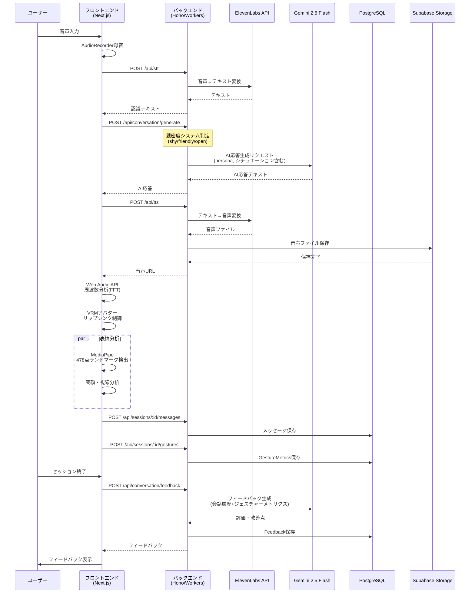

# 恋AI - Architecture Documentation

## Overview
**恋AI(renai)** is a web application that improves communication skills (especially with the opposite sex) through 3D real-time AI conversation simulation. It provides feedback on both verbal communication (conversation skills) and non-verbal communication (facial expressions, eye contact).

## System Architecture

### Overall Architecture Diagram

```mermaid
graph TB
    subgraph "クライアント層"
        User[ユーザー]
        Partner[パートナー]
        Camera[カメラ]
        Mic[マイク]
    end

    subgraph "フロントエンド - Next.js 15 on Vercel"
        subgraph "主要ページ"
            SimPage[/simulation<br/>AI会話シミュレーション]
            FeedbackPage[/feedback<br/>フィードバック表示]
            PracticePage[/practice<br/>練習予約]
            PartnerPage[/partner<br/>パートナーダッシュボード]
            SessionPage[/session<br/>セッション詳細]
            TestCallPage[/test-call<br/>通話テスト]
        end

        subgraph "コアフック"
            UseConversation[useConversation<br/>会話管理]
            UseFacialAnalysis[useFacialAnalysis<br/>MediaPipe表情分析]
            UseLipSync[useLipSync<br/>Web Audio APIリップシンク]
            UseVRM[useVRM<br/>VRM制御]
            UseAgoraCall[useAgoraCall<br/>Agoraビデオ通話]
        end

        subgraph "3D/UI層"
            VRMAvatar[VRMアバター<br/>React Three Fiber]
            MediaPipe[MediaPipe<br/>478点顔ランドマーク]
            AudioRecorder[AudioRecorder<br/>音声録音]
        end
    end

    subgraph "バックエンド - Hono on Cloudflare Workers"
        subgraph "APIルート"
            SessionsAPI[/api/sessions<br/>セッション管理]
            ConversationAPI[/api/conversation<br/>AI会話生成]
            FeedbackAPI[/api/feedback<br/>フィードバック生成]
            SpeechAPI[/api/stt, /api/tts<br/>音声処理]
            AgoraAPI[/api/agora/token<br/>トークン生成]
            PartnersAPI[/api/partners<br/>パートナー管理]
            AuthAPI[/api/auth<br/>Better Auth]
        end

        subgraph "サービス層"
            ConversationService[conversation.ts<br/>ビジネスロジック]
            AIClient[ai-client.ts<br/>Gemini APIクライアント]
            STTService[stt.ts<br/>STT/TTS処理]
        end
    end

    subgraph "データベース層 - Supabase"
        PostgreSQL[(PostgreSQL)]
        Storage[(Supabase Storage<br/>音声ファイル)]
    end

    subgraph "外部サービス"
        Gemini[Google Gemini 2.5 Flash<br/>AI会話・フィードバック]
        ElevenLabs[ElevenLabs API<br/>TTS/STT]
        Agora[Agora RTC<br/>ビデオ通話]
    end

    subgraph "データモデル - Prisma"
        Conversation[Conversation<br/>会話セッション]
        Message[Message<br/>メッセージ履歴]
        Feedback[Feedback<br/>フィードバック]
        GestureMetrics[GestureMetrics<br/>表情・視線データ]
        HumanPartnerSession[HumanPartnerSession<br/>人間パートナーセッション]
        HumanPartnerFeedback[HumanPartnerFeedback<br/>パートナーフィードバック]
        PracticeSlot[PracticeSlot<br/>予約枠]
        UserModel[User<br/>ユーザー]
    end

    %% クライアント → フロントエンド
    User --> SimPage
    User --> FeedbackPage
    User --> PracticePage
    Partner --> PartnerPage
    Camera --> MediaPipe
    Mic --> AudioRecorder

    %% フロントエンド内部フロー
    SimPage --> UseConversation
    SimPage --> UseFacialAnalysis
    SimPage --> UseVRM
    UseConversation --> AudioRecorder
    UseFacialAnalysis --> MediaPipe
    UseVRM --> VRMAvatar
    UseLipSync --> VRMAvatar

    TestCallPage --> UseAgoraCall
    SessionPage --> UseAgoraCall

    %% フロントエンド → バックエンド
    UseConversation --> SpeechAPI
    UseConversation --> ConversationAPI
    FeedbackPage --> FeedbackAPI
    PracticePage --> PartnersAPI
    PartnerPage --> PartnersAPI
    UseAgoraCall --> AgoraAPI
    SimPage --> SessionsAPI

    %% バックエンド内部フロー
    ConversationAPI --> ConversationService
    FeedbackAPI --> ConversationService
    ConversationService --> AIClient
    SpeechAPI --> STTService

    %% バックエンド → 外部サービス
    AIClient --> Gemini
    STTService --> ElevenLabs
    AgoraAPI --> Agora

    %% バックエンド → データベース
    SessionsAPI --> PostgreSQL
    ConversationService --> PostgreSQL
    STTService --> Storage
    PartnersAPI --> PostgreSQL
    AuthAPI --> PostgreSQL

    %% データモデルリレーション
    Conversation --> Message
    Conversation --> Feedback
    Conversation --> GestureMetrics
    HumanPartnerSession --> HumanPartnerFeedback
    HumanPartnerSession --> PracticeSlot
    UserModel --> HumanPartnerSession

    %% スタイリング
    classDef frontend fill:#61dafb,stroke:#333,stroke-width:2px,color:#000
    classDef backend fill:#f39c12,stroke:#333,stroke-width:2px,color:#000
    classDef database fill:#2ecc71,stroke:#333,stroke-width:2px,color:#000
    classDef external fill:#e74c3c,stroke:#333,stroke-width:2px,color:#fff
    classDef model fill:#9b59b6,stroke:#333,stroke-width:2px,color:#fff

    class SimPage,FeedbackPage,PracticePage,PartnerPage,SessionPage,TestCallPage,UseConversation,UseFacialAnalysis,UseLipSync,UseVRM,UseAgoraCall,VRMAvatar,MediaPipe,AudioRecorder frontend
    class SessionsAPI,ConversationAPI,FeedbackAPI,SpeechAPI,AgoraAPI,PartnersAPI,AuthAPI,ConversationService,AIClient,STTService backend
    class PostgreSQL,Storage database
    class Gemini,ElevenLabs,Agora external
    class Conversation,Message,Feedback,GestureMetrics,HumanPartnerSession,HumanPartnerFeedback,PracticeSlot,UserModel model
```

### Conversation Flow Sequence



### Technology Stack

```mermaid
graph LR
    subgraph "フロントエンド技術"
        NextJS[Next.js 15<br/>React 19]
        R3F[React Three Fiber<br/>Three.js]
        VRM[@pixiv/three-vrm<br/>VRMモデル]
        MediaPipeLib[MediaPipe<br/>顔分析]
        WebAPIs[Web APIs<br/>Speech/Audio]
        Agora1[Agora RTC SDK]
    end

    subgraph "バックエンド技術"
        Hono[Hono Framework]
        Workers[Cloudflare Workers]
        ZodOpenAPI[@hono/zod-openapi]
        BetterAuth[Better Auth]
    end

    subgraph "データ層"
        Prisma[Prisma ORM]
        PrismaAccelerate[Prisma Accelerate]
        Supabase[Supabase<br/>PostgreSQL + Storage]
    end

    subgraph "AI/外部サービス"
        Gemini2[Google Gemini<br/>2.5 Flash]
        ElevenLabs2[ElevenLabs<br/>TTS/STT]
        Agora2[Agora RTC]
    end

    NextJS --> R3F
    R3F --> VRM
    NextJS --> MediaPipeLib
    NextJS --> WebAPIs
    NextJS --> Agora1

    Hono --> Workers
    Hono --> ZodOpenAPI
    Hono --> BetterAuth

    Hono --> Prisma
    Prisma --> PrismaAccelerate
    PrismaAccelerate --> Supabase
    NextJS --> Prisma

    Hono --> Gemini2
    Hono --> ElevenLabs2
    Hono --> Agora2
```

## Technology Stack Details

### Frontend
- **Framework**: Next.js 15 (App Router), React 19
- **3D Rendering**:
  - React Three Fiber (Three.js React wrapper)
  - @pixiv/three-vrm (VRM model loading and rendering)
  - @pixiv/three-vrm-animation (Animation control)
- **Facial Analysis**: MediaPipe Tasks Vision (478-point face landmark detection)
- **Audio Processing**:
  - Web Speech API (Speech recognition)
  - Web Audio API (Frequency analysis for lip sync)
  - ElevenLabs API (TTS/STT)
- **Video Calling**: Agora RTC SDK
- **Styling**: TailwindCSS 4
- **UI**: Radix UI
- **Testing**: Jest, React Testing Library
- **Type Safety**: TypeScript

### Backend
- **Framework**: Hono (Lightweight web framework)
- **Runtime**: Cloudflare Workers (Edge computing)
- **API Design**: @hono/zod-openapi (Auto-generate OpenAPI schema)
- **ORM**: Prisma (PostgreSQL)
- **Authentication**: Better Auth
- **Validation**: Zod

### Database & Storage
- **DB**: Supabase PostgreSQL
- **ORM**: Prisma (Two separate client generations for frontend and backend)
- **Storage**: Supabase Storage (Audio file storage)
- **Edge DB Connection**: Prisma Accelerate (Cloudflare Workers support)

### AI & External Services
- **Conversation Generation**: Google Gemini 2.5 Flash
- **Speech Synthesis**: ElevenLabs API
- **Video Calling**: Agora RTC

### Infrastructure & Deployment
- **Frontend**: Vercel
- **Backend**: Cloudflare Workers
- **Monorepo Management**: pnpm workspace
- **CI/CD**: GitHub Actions, Husky (Git hooks)
- **Code Quality**: Biome (Linter & Formatter)

## Directory Structure

### Root Structure
```
/home/daccho/code/tk_b_2515/
├── frontend/          # Next.js frontend
├── backend/           # Hono backend
├── prisma/            # Prisma schema (shared)
├── .claude/           # Claude Code configuration
├── .tmp/              # Temporary files (design docs, task management)
├── docs/              # Documentation
├── pnpm-workspace.yaml # Monorepo configuration
└── package.json       # Root package
```

### Frontend Structure
```
frontend/src/
├── app/                 # Next.js App Router pages
│   ├── page.tsx         # Home page
│   ├── login/           # Login
│   ├── signup/          # Signup
│   ├── simulation/      # AI conversation simulation
│   ├── feedback/        # Feedback display
│   ├── practice/        # Human partner practice booking
│   ├── partner/         # Partner pages
│   ├── session/         # Session details
│   ├── test-call/       # Video call test
│   └── api/             # Next.js API Routes (auth callbacks, etc.)
├── components/          # React components
│   ├── Avatar/          # VRM avatar components
│   ├── simulation/      # Simulation UI
│   ├── auth/            # Auth UI
│   └── ui/              # Common UI components
├── hooks/               # Custom hooks
│   ├── useConversation.ts      # Conversation management (STT→AI→TTS)
│   ├── useFacialAnalysis.ts    # MediaPipe facial analysis
│   ├── useLipSync.ts           # Web Audio API lip sync
│   ├── useVRM.ts               # VRM control
│   ├── useAudioRecorder.ts     # Audio recording
│   ├── useGestureTracking.ts   # Gesture tracking
│   ├── useAgoraCall.ts         # Agora video call
│   └── useSimulationTimer.ts   # Timer
├── lib/                 # Utilities
│   ├── api/             # API client (fetch wrapper)
│   ├── audio/           # Audio analysis utilities
│   ├── cache/           # Audio cache
│   ├── auth.ts          # Better Auth configuration
│   ├── prisma.ts        # Prisma client
│   └── supabase.ts      # Supabase client
└── __tests__/           # Test code
```

### Backend Structure
```
backend/src/
├── index.ts             # Entry point
├── server.ts            # Local development server
├── routes/              # API routes
│   ├── api.ts           # Route integration
│   └── modules/         # Feature-based route modules
│       ├── sessions.routes.ts      # Session management
│       ├── messages.routes.ts      # Messages
│       ├── conversation.routes.ts  # AI conversation generation
│       ├── feedback.routes.ts      # Feedback
│       ├── speech.routes.ts        # STT/TTS
│       ├── agora.routes.ts         # Agora token generation
│       ├── partners.routes.ts      # Partner management
│       ├── auth.routes.ts          # Authentication
│       └── debug.routes.ts         # Debug endpoints
├── services/            # Business logic
│   ├── conversation.ts  # AI conversation & feedback generation
│   ├── ai-client.ts     # Gemini API client
│   ├── stt.ts           # STT/TTS processing
│   └── client.ts        # Common API client
├── middleware/          # Middleware
│   ├── env.ts           # Environment variable validation
│   ├── logger.ts        # Logging
│   └── error.ts         # Error handling
└── lib/                 # Libraries
    ├── prisma.ts        # Prisma client
    └── supabase.ts      # Supabase client
```

## Data Models (Prisma Schema)

### AI Conversation Related
- **Conversation**: Conversation session
- **Message**: Message history (user/assistant)
- **Feedback**: AI feedback (verbal/non-verbal evaluation, scores)
- **GestureMetrics**: Facial expression and eye contact data aggregation

### Human Partner Related
- **HumanPartnerSession**: Video call session with human partner
- **HumanPartnerFeedback**: Session feedback (AI + partner evaluation)
- **PracticeSlot**: Partner booking slot management

### Authentication
- **User**: User (role: user/partner/admin)
- **Account**: Account information (Better Auth)
- **Session**: Session information
- **Verification**: Verification information

### Relations
- `Conversation` 1:N `Message`
- `Conversation` 1:1 `Feedback`
- `Conversation` 1:1 `GestureMetrics`
- `HumanPartnerSession` 1:1 `HumanPartnerFeedback`
- `HumanPartnerSession` N:1 `PracticeSlot`
- `User` 1:N `HumanPartnerSession` (both user and partner relations)

## Core Architecture Patterns

### Intimacy System
Three levels of intimacy (shy/friendly/open) that change AI response style. System prompts are dynamically generated, controlling emoji usage rules as well.

Location: [backend/src/services/conversation.ts](../backend/src/services/conversation.ts)

### MediaPipe Facial Analysis
Independent algorithm analyzes eye contact and smiles from 478 face landmarks. Performance optimized at 3fps (333ms intervals).

Location: [frontend/src/hooks/useFacialAnalysis.ts](../frontend/src/hooks/useFacialAnalysis.ts)

### Lip Sync
Frequency analysis (FFT 2048) with Web Audio API, human voice range extraction (300-3400Hz), natural animation with attack/release control.

Location: [frontend/src/hooks/useLipSync.ts](../frontend/src/hooks/useLipSync.ts)

### Comprehensive Feedback
Evaluation from both verbal (conversation skills) and non-verbal (expressions, eye contact) aspects. Deduction system, specific improvement suggestions.

## Deployment Architecture

```
[Frontend: Vercel]
    Next.js 15
    ↓
[Backend: Cloudflare Workers]
    Hono + Prisma Accelerate
    ↓
[Database: Supabase PostgreSQL]
[Storage: Supabase Storage]
[External APIs]
    - Google Gemini
    - ElevenLabs
    - Agora RTC
```

### Environment Variables
- Frontend: Vercel Environment Variables
- Backend: Cloudflare Workers Secrets
- Local Development: `.env` (refer to `.env.example`)

## Unique Design Decisions

1. **Monorepo Structure**: Separate frontend/backend while sharing Prisma schema
2. **Two Prisma Clients**: Separate output for frontend and backend
3. **Intimacy Level Control**: Conversation style changes based on message count
4. **3fps Facial Analysis**: Balance between performance and accuracy
5. **Edge Computing**: Low latency with Cloudflare Workers
6. **Human Partner Feature**: Practice with real people, not just AI

## Technical Challenges & Solutions

### Prisma on Cloudflare Workers
- **Challenge**: Direct DB connection not possible on edge runtime
- **Solution**: Use Prisma Accelerate

### MediaPipe Timestamp Constraints
- **Challenge**: detectForVideo requires monotonically increasing integers (microseconds)
- **Solution**: Maintain previous timestamp, implement monotonic increase guarantee logic

### Autoplay Restrictions
- **Challenge**: TTS audio playback fails due to browser autoplay restrictions
- **Solution**: Error handling, display message prompting user interaction

## API Endpoints

```
/api
├── /health                         # Health check
├── /auth                           # Authentication (Better Auth)
├── /sessions                       # Session management
│   ├── POST /sessions              # Create session
│   ├── GET /sessions/:id           # Get session
│   ├── PATCH /sessions/:id/finish  # Finish session
│   ├── POST /sessions/:id/messages # Save message
│   ├── POST /sessions/:id/gestures # Save gesture metrics
│   └── POST /sessions/:id/feedback # Save feedback
├── /conversation                   # AI conversation
│   ├── POST /generate              # Generate AI response (Gemini)
│   └── POST /feedback              # Generate feedback
├── /stt                            # Speech-to-text
├── /tts                            # Text-to-speech
├── /voices                         # Available voices list
├── /agora/token                    # Agora token generation
└── /partners                       # Partner management
    ├── GET /sessions/waiting       # List waiting sessions
    └── PATCH /sessions/:id/join    # Join session
```

## Key Features

### AI Conversation Simulation
- 3D VRM avatar with realistic lip sync
- Real-time facial expression and eye contact analysis
- Multi-level intimacy system
- Multiple scenarios (library, classroom, Christmas)

### Comprehensive Feedback
- Verbal evaluation (leadership, continuity, development, empathy, question appropriateness)
- Non-verbal evaluation (smile, eye contact stability, eye direction)
- Deduction system (AI question count, conversation breaks, short utterances)
- Specific improvement suggestions

### Human Partner Practice
- Video call sessions with real partners
- Booking slot management
- Combined AI and partner feedback

## Performance Optimizations

1. **Audio Caching**: Cache TTS audio files to reduce API calls
2. **3fps Facial Analysis**: Reduce processing frequency for better performance
3. **Edge Computing**: Deploy backend on Cloudflare Workers for low latency
4. **Lazy Loading**: Lazy load heavy 3D models and libraries
5. **Prisma Accelerate**: Connection pooling for database access
