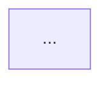

# アーキテクチャ図をスライドに貼る方法

このディレクトリには恋AIプロジェクトのMermaid図が含まれています。以下の方法でスライドに貼り付けることができます。

## ファイル一覧

- `overall-architecture.mmd`: 全体アーキテクチャ図
- `conversation-flow.mmd`: 会話フローシーケンス図
- `tech-stack.mmd`: 技術スタック図

## 方法1: Mermaid Live Editor (推奨)

最も簡単で高品質な方法です。

1. **Mermaid Live Editorを開く**: https://mermaid.live/
2. 該当する`.mmd`ファイルの内容をコピー
3. エディタに貼り付け
4. 右上の「Actions」→「Export」から形式を選択:
   - **SVG**: ベクター形式、拡大しても劣化しない(最推奨)
   - **PNG**: 高品質ラスター画像、背景透過可能
   - **PDF**: スライドソフトによっては直接貼り付け可能
5. ダウンロードしてスライドに挿入

### 推奨設定
- **PowerPoint/Keynote**: SVGまたはPNG(高解像度)
- **Google Slides**: PNGまたはSVG
- **LaTeX Beamer**: PDF

## 方法2: VS Code拡張機能

リアルタイムプレビューしながら作業できます。

### 必要な拡張機能
- **Markdown Preview Mermaid Support** (bierner.markdown-mermaid)
- **Mermaid Editor** (tomoyukim.vscode-mermaid-editor)

### 手順
1. VS Codeで該当の`.mmd`ファイルを開く
2. コマンドパレット(Ctrl/Cmd+Shift+P)→「Mermaid Editor: Preview」
3. プレビュー画面で右クリック→「Copy Image」または「Export to PNG/SVG」
4. スライドに貼り付け

## 方法3: Markdown経由でプレビュー

1. [architecture.md](../architecture.md)をVS Codeで開く
2. プレビューモード(Ctrl/Cmd+Shift+V)で表示
3. 図を右クリック→「画像をコピー」
4. スライドに貼り付け

※この方法は解像度が低い場合があるため、重要なプレゼンには方法1を推奨

## 方法4: オンラインツール

### Mermaid Chart (https://www.mermaidchart.com/)
- アカウント登録が必要
- 高度な編集機能とチーム共有機能あり
- PNG/SVG/PDFエクスポート可能

### Kroki (https://kroki.io/)
- アカウント不要
- URLにMermaidコードを埋め込んで画像生成
- 例: `https://kroki.io/mermaid/svg/[base64エンコードされたコード]`

## 方法5: スライドソフト内蔵のMermaidサポート

一部のスライドツールはMermaidを直接サポートしています。

### Slidev (Markdown製スライド)
```markdown

```

### Reveal.js
```html
<section>
  <pre class="mermaid">
    graph TB
    ...
  </pre>
</section>
```

### Marp (Markdown製スライド)
```markdown
---
marp: true
---

# スライドタイトル


```

## トラブルシューティング

### 日本語が文字化けする
- Mermaid Live Editorを使用(フォント対応済み)
- エクスポート時にフォント埋め込みオプションを有効化

### 図が大きすぎる/小さすぎる
- Mermaid Live Editorで「Configuration」→「Scale」を調整
- SVGの場合、スライド側で自由にリサイズ可能

### 色を変更したい
- `.mmd`ファイルの`classDef`部分を編集
- または、Mermaid Live Editorの「Configuration」→「Theme」で変更

## 推奨ワークフロー

プレゼン用途別の推奨方法:

| 用途 | 推奨方法 | フォーマット |
|------|---------|------------|
| 社内プレゼン | Mermaid Live Editor | PNG (透過背景) |
| 学会発表 | Mermaid Live Editor | SVG または PDF |
| ポスター | Mermaid Live Editor | SVG (高解像度) |
| ドキュメント | Markdown内埋め込み | Mermaid コード |
| Webサイト | Mermaid.js直接レンダリング | Mermaid コード |

## 参考リンク

- Mermaid公式ドキュメント: https://mermaid.js.org/
- Mermaid Live Editor: https://mermaid.live/
- Mermaid構文チートシート: https://jojozhuang.github.io/tutorial/mermaid-cheat-sheet/
